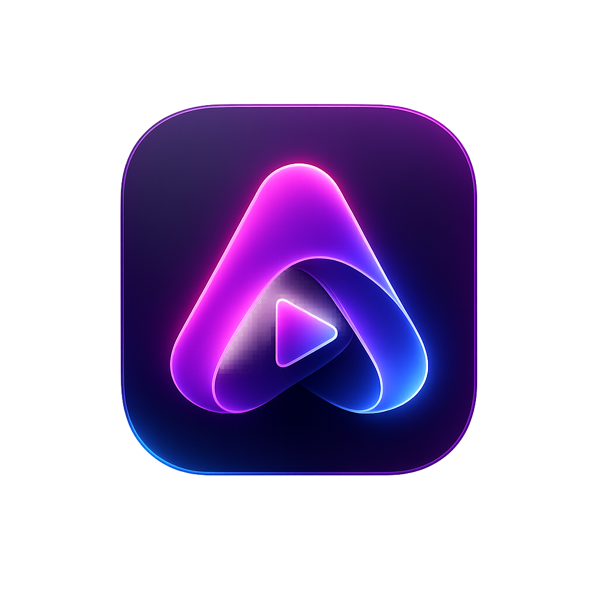

<p align="center">
  
</p>

# AuraPlayer — Modern Offline Native Audio Player

AuraPlayer is a native offline-first music player featuring a gorgeous, theme-adaptive design, continuous music playback with no silence between tracks, and comprehensive dynamic pages to easily explore your music collection.

---

## 📺 Demo


---

### 🚀 Pre-Release Binaries & Cross-Platform Testing Help Needed!

I have officially published a **[Pre-Release version](https://github.com/parsaalavi1382/AuraPlayer/releases/tag/v1.0.1-beta)** with compiled binaries for **Windows, macOS, and Linux**.

* **Windows:** Fully packaged and verified using Inno Setup (`installer.iss`). It works perfectly.
* **macOS & Linux:** The build pipelines are configured via GitHub Actions (`release.yml`), but since I do not have physical access to a Mac or Linux machine to properly test the environment hooks, **I need your help!**

If you are on macOS or Linux, I would deeply appreciate it if you could download the pre-release, run it, and let me know how it handles native audio output, fonts, and window framing.

---

## ⚠️ Project Status: In Development

Please note that this project is **currently in progress and is not yet fully completed**, so it may contain some bugs or unpolished corners. Core features like playback, gapless audio, library scanning, metadata editing, lyric sync, and dynamic theme transitions are fully functional.

🐛 **Found an issue?** If you run into any bugs or have suggestions, please open a ticket in the **Issues** section.

🤝 **Contributions:** I would be extremely happy to receive your pull requests! Feel free to fork the repository and contribute.

---

## 🎨 What AuraPlayer Does Right Now

### 1. Dynamic Pages & Rich Navigation (Featuring Smart Multi-Artist Support)
* **Smart Multi-Artist Support:** Features an intelligent music organizer. It automatically splits collaborating artists (separated by characters or words like commas, ampersands, or "feat.") so that songs neatly appear under the individual profile of every contributing artist.
* **Artist Page:** Shows helpful statistics (like total track counts), a list of albums they released, a contributor section ("Appears On") for guest features, and a complete table of their tracks. Albums and guest features are laid out in a clean, wrapping grid that automatically resizes to fit your window, similar to photo grids on social media.
* **Album Page:** Displays a gorgeous view with large cover art, year of release, total duration, and clickable artist buttons. Tracks are automatically grouped by disc numbers. Additionally, track numbers morph into a play button when you hover, and transform into a lively dancing music equalizer during active playback.
* **Genre Page:** Displays songs filtered by selected genre, featuring instant play and shuffle controls.
* **Genres Tab:** A complete, alphabetically sorted list of all genres in your music library with track counts.
* **Aesthetic Tab Titles:** Dynamic pages display clean, professional titles like `Artist Name | Artist`, `Album Name | Album`, or `Genre Name | Genre`.
* **Smart Closable Tabs:** Dynamically opened pages can be closed with an "X" button, while permanent main navigation tabs (Tracks, Artists, Genres, Albums, Playlists) are securely locked in place.
* **Underlined Hover Feedback:** Hovering over artist or album names anywhere in the app displays elegant underlines with pointing-hand feedback; clicking them takes you directly to their dedicated pages.

### 2. Cover Art with Active Playback States & Vector Placeholders
* Displays high-quality album covers or beautiful, theme-adaptive vector placeholders (using `disc.svg` dynamically colored by the active theme, completely removing raw emojis or text-character fallback icons).
* **State A (PLAYING):** Cover art dims slightly and displays a beautiful, pulsing 3-bar animated equalizer.
* **State B (PAUSED + HOVER):** Cover art dims and displays an overlaid "▶" play icon.
* **State C (PAUSED + NO HOVER):** Cover art renders at full brightness with no overlays.

### 3. Advanced Audio Player Engine
* Plays popular music formats including `.mp3`, `.flac`, `.m4a`, `.wav`, and `.ogg` files.
* **Silence-Free Playback:** Automatically preloads the next song in the background to hand off seamlessly near the end of the current track, ensuring no silent gaps between songs.
* **Smart Music Controls:** Precise single-clicks for track skipping, press-and-hold for continuous fast-forward or rewind (seeking) inside a song, and a smart rewind button (restarts the current song if played past 3 seconds; otherwise skips to the actual previous song).
* **Remember Play State:** Automatically remembers your queue, active song, volume level, and exact listening position across restarts so you can resume listening instantly.
* **Volume & Output Selector:** Change your volume or choose headphones/speakers directly from the player screen. Settings are remembered across restarts, with an automatic fallback to the default device if headphones are unplugged. Includes an intuitive speaker icon that toggles quick muting and unmuting.

### 4. Smart Library Scanner & Secure Storage
* **Background Scanning:** Scans your selected music folders on a background worker with an elegant progress screen, meaning your app stays fast and responsive with absolutely no freezing.
* **Automatic Folder Synchronization:** Like a mini version-control system for your music, the app automatically checks your folders for new, deleted, or updated songs every 30 seconds and on startup. It keeps your library perfectly in sync with no manual effort.
* **Smart Missing-Folder Prompts:** If a whole music folder goes missing (like an unplugged external drive), AuraPlayer gracefully alerts you, giving you the choice to safely remove those tracks or keep them and retry sync once the folder is connected.
* **Secure Storage Protection:** Automatically saves your library state safely, making sure a sudden computer shutdown or app crash never corrupts or loses your music collection.
* **Smart Duplication Prevention:** Automatically avoids duplicates when you rescan folders.
* **Missing File Safeguards:** If you delete or move a file outside the app, its row turns red in the Tracks list. Clicking it shows a helpful warning rather than crashing.

### 5. Personalization, Metadata Editing & Settings
* **Instant Song Tag Editor:** Right-click any track in the list and select "Edit Metadata" to open the advanced tag editor. Update song titles, albums, release years, and custom album cover images directly.
* **Tag Chip Input Field:** Supports multi-valued tags like multiple artists, album artists, and genres with stylish, interactive chip blocks. Typing a comma (`,`) or pressing Enter instantly splits and converts your text into a new chip. Each chip features an "✕" button to easily delete tags.
* **Unsaved Changes Safeguard:** To prevent losing your hard work, closing the editor with unsaved changes prompts a gentle warning, allowing you to go back and save.
* **Real-Time Themes:** Features immediate, single-click theme switching in Settings: **Dark (default)**, **Light**, **Midnight Blue**, and **Warm Amber**. The entire design updates instantly without needing to restart.
* **Custom Separation Manager:** In the settings screen, you can easily add, edit, or toggle the specific words or symbols (like commas or 'feat.') that AuraPlayer uses to split multiple artists, giving you ultimate control over how your library is organized.
* **Remembers Window Preferences:** AuraPlayer automatically remembers your window size, position, and layout preferences across restarts, so it always reopens exactly how you left it.

### 6. Interactive Synced Lyrics & Dynamic Playback Queue Panel
* **Karaoke-Style Lyrics Highlight:** Renders plain text or synced lyrics (`.lrc`, `.txt`, and embedded tags) with smooth vertical scrolling and live karaoke-style line highlighting matching current playback.
* **Manual Scroll Recovery (Sync):** If you scroll away manually to read ahead, a floating "Sync" button appears; clicking it slides the viewport back to the playing lyric smoothly.
* **In-App Offline Lyrics Editor:** Includes a full-height, code-styled editing dialog to write, paste, or format lyrics, saving directly back to disk or embedded tags.
* **Slide-out Queue Side-Panel:** A reusable panel that slides out smoothly from the right in both the full Player Screen and the Main Window (triggered by the 📋 Queue button). Both views stay in perfect synchronization.
* **Add Tracks to Queue from Any View:** Seamlessly append or add tracks to the playback queue from any tab or page featuring a track list (Tracks view, Album page, Artist page, Genre page, or Playlist page).
* **Drag-and-Drop Queue Reordering:** Rearrange tracks inside the queue list using standard drag-and-drop rows, which immediately updates the playback engine's queue order.
* **Full Queue Context Controls:** Right-click queue tracks to trigger "Play Now" or "Remove", use the `Delete` key to clear tracks, or wipe the entire queue via the flat "Clear Queue" button.

### 7. Playlists System, Custom Cover Art & Drag-and-Drop Integration
* **Smart & Custom Playlists:** Features automated Smart Playlists (*Favorites*, *Recently Added*, *Recently Played*, *Most Played*) alongside full support for creating, renaming, and deleting Custom Playlists.
* **Custom Playlist Cover Art & Smart Collage Fallback:** Custom playlists support setting a custom cover image. If no custom image is assigned, AuraPlayer automatically generates a beautiful default cover collage using the artwork from the first 4 unique albums added to that playlist (ordered by addition date). If tracks are deleted or modified, the collage dynamically cascades to display the next available album artwork.
* **Drag-and-Drop from Queue to Playlists:** Drag songs directly out of the Queue side-panel and drop them onto any custom playlist or smart playlist card to add them instantly.

---

## 🚀 Installation & Setup

Follow these simple steps to set up a clean Python virtual environment, install the required packages, and run AuraPlayer.

### 1. Create a Virtual Environment (`venv`)
Creating a virtual environment ensures AuraPlayer's dependencies do not conflict with other Python packages on your system.

* **On Windows / macOS / Linux:**
    ```bash
    python -m venv venv
    ```

### 2. Activate the Virtual Environment
Before installing packages or running the app, you must activate the virtual environment.

* **On Windows (Command Prompt):**
    ```cmd
    venv\Scripts\activate.bat
    ```
* **On Windows (PowerShell):**
    ```powershell
    venv\Scripts\activate.ps1
    ```
* **On macOS / Linux (Terminal):**
    ```bash
    source venv/bin/activate
    ```

*(Once activated, you will see `(venv)` prepended to your command line prompt.)*

### 3. Install Dependencies
Install all required third-party libraries (including those for window styling and music file parsing) using pip:

```bash
pip install -r requirements.txt

```

### 4. Run the Application

Start the AuraPlayer application by executing the main script:

```bash
python main.py

```

---

## 🎵 Getting Started with Music

1. When you first launch AuraPlayer, your library will be empty.
2. Click the **⚙ (Settings)** icon in the top-right corner.
3. Click **Add Folder** and select the bundled `test_music/` folder (which contains 8 tagged test files of different formats) or point it at your real music library.
4. The progress dialog will show the scanning status. Once completed, your Tracks, Artists, Genres, and Albums tabs will be fully populated!

---

## 🗺️ Roadmap & Tracking

To see what is currently planned or what has been achieved so far, check out our development logs:

* 📋 **[Feature Backlog](FEATURE_BACKLOG.md):** Detailed look at upcoming tasks, including the **Complete Playlist System** (Manual & Smart Playlists) and **Lyrics Display Integration**.
* 🪵 **[Progress Log](PROGRESS_LOG.md):** Track day-to-day development history, implemented logic, and completed milestones.

---

## 🤝 Contributing

Contributions, feature ideas, and bug reports are highly welcome!

* Feel free to open an **Issue** to discuss features.
* Submit a **Pull Request** if you'd like to help polish existing code or implement roadmap tasks.

---

## 📄 License

This project is open-source and available under the [MIT License](LICENSE.md).

